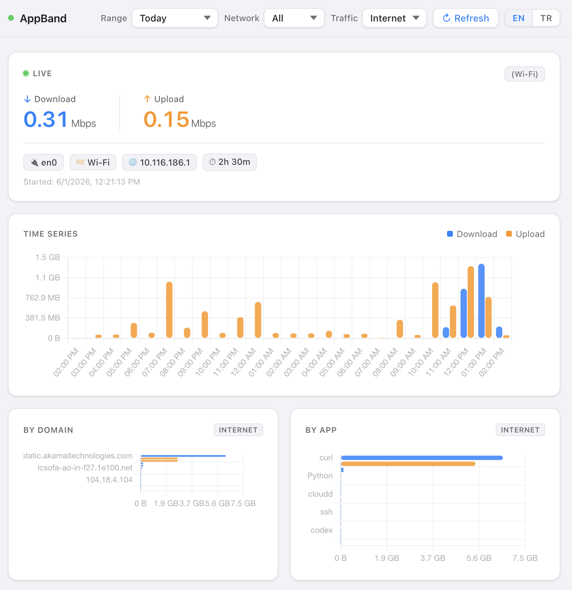
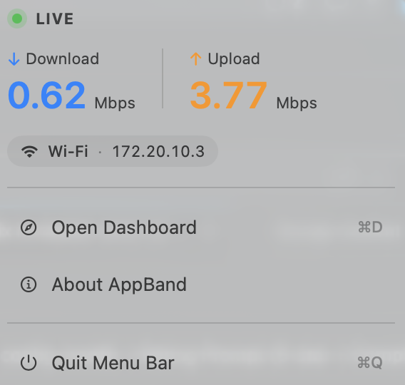

# AppBand

**Per-App Bandwidth & Network Monitor for macOS**

**[⬇ Download AppBand 0.2.0 (DMG)](https://github.com/evrenbilen/appband/releases/latest)**  ·  macOS 13+  ·  ~500 KB

[Gatekeeper bypass (first launch only)](#gatekeeper-bypass-first-launch-only)

## Screenshots

### Dashboard



### Menu bar

The menu bar item shows the current download / upload throughput inline; clicking opens a popover with the same LIVE panel you see in the dashboard.




AppBand is a local, privacy-respecting network usage monitor for macOS. It tracks which app on your machine talked to which destination, over which network, for how many bytes — and shows it on a local web dashboard.

- Zero external dependencies (Python 3 stdlib only — no `pip install`)
- Runs as a user-level LaunchAgent in the background
- All data stays on your Mac in a local SQLite database
- Dashboard at `http://127.0.0.1:8765/` (localhost only)

## What it tracks

- Active network: interface, link type (wifi / iphone-hotspot / usb-tether / ethernet / vpn), SSID
- Total bytes per 5 seconds (per network route)
- Bytes per process per 10 seconds (via `nettop`, loopback excluded)
- Active outbound connections per 30 seconds with reverse-DNS caching
- Internet vs LAN traffic distinction
- 30 days of history, auto-purged

## Install

### Download the DMG (easiest)

1. Download **AppBand-0.2.0.dmg** from the [latest release](https://github.com/evrenbilen/appband/releases/latest).
2. Open the DMG and drag **AppBand.app** to **Applications**.
3. **First launch** — see the [Gatekeeper bypass](#gatekeeper-bypass-first-launch-only) section below to unblock the app on first open.
4. On launch, AppBand installs the background services into `~/Library/Application Support/AppBand/` and opens the dashboard at http://127.0.0.1:8765/. A small ↓/↑ Mbps indicator appears in your menu bar.

### Install from source

```bash
git clone https://github.com/evrenbilen/appband ~/Development/appband
cd ~/Development/appband
./scripts/install.sh
```

## Gatekeeper bypass (first launch only)

When you launch AppBand for the first time, macOS shows:

> *"Apple could not verify 'AppBand' is free of malware that may harm your Mac or compromise your privacy."*

with only **Move to Trash** / **Done** buttons. This is **expected** and **safe to bypass** — here is why, and how.

### Why this happens

AppBand is **ad-hoc signed** (a developer signature stamp is applied locally during build) but **not notarized** by Apple. Notarization requires a paid Apple Developer Program membership ($99 / year). Until that's set up, every AppBand release will trigger this warning on a clean Mac.

Code that comes from the public AppBand repository (this one) is built reproducibly from sources you can inspect. Each release publishes an `AppBand-<version>.dmg.sha256` checksum file alongside the DMG (generated by the release CI); verify your download with `shasum -a 256 AppBand-<version>.dmg` and compare.

### Bypass — Terminal one-liner (recommended)

The fastest way: tell macOS to remove the "downloaded from the Internet" quarantine flag from the app.

```bash
xattr -dr com.apple.quarantine /Applications/AppBand.app
```

Double-click `AppBand.app` afterwards — it opens cleanly.

### Bypass — System Settings (no Terminal)

1. Double-click `AppBand.app`. The Gatekeeper warning appears.
2. Click **Done** to dismiss it.
3. Open **System Settings → Privacy & Security**.
4. Scroll down — you'll see *"AppBand was blocked to protect your Mac"*.
5. Click **Open Anyway**.
6. Confirm with your password / Touch ID.
7. Double-click `AppBand.app` again — it opens.

### When will this go away

When the project graduates to a paid Apple Developer Program account, releases will be notarized and the warning disappears. Until then, see [issue #1](https://github.com/evrenbilen/appband/issues) for status / discussion. If you want to help fund notarization, sponsoring the project is welcome — see the Sponsor button on the repo.

## Status & uninstall

```bash
./scripts/status.sh             # show services + DB stats + recent log
./scripts/uninstall.sh          # stop services, keep DB
./scripts/uninstall.sh --purge  # stop services and delete DB
./scripts/vacuum.sh             # compact DB
```

## Storage

- DB:   `~/Library/Application Support/appband/appband.db` (SQLite WAL)
- Logs: `~/Library/Logs/appband/{collector,server}.log`

## Troubleshooting

- **First launch is blocked / "could not verify"** — expected (ad-hoc signed, not notarized). See [Gatekeeper bypass](#gatekeeper-bypass-first-launch-only).
- **Menu bar shows `⚠ offline` / no data** — the background services aren't responding. Run `./scripts/status.sh` (or check `launchctl list | grep appband`); from the menu-bar popover, **Restart Services** kicks them. Confirm health at `http://127.0.0.1:8765/api/health`.
- **Dashboard won't open at `http://127.0.0.1:8765/`** — make sure `dev.appband.server` is loaded (`./scripts/status.sh`), then check `~/Library/Logs/appband/server.log`. The dashboard is localhost-only and rejects non-loopback `Host`/`Origin` requests by design.
- **A flat stretch in the time series** — if it shows a "collection gap" banner, the Mac was asleep / the collector was down then (not zero traffic).
- **Per-app or per-domain numbers look off / don't sum to the total** — the by-domain and scoped by-app panels are **approximate** (see [Caveats](#caveats)); the LIVE per-app list and totals are exact.
- **Start fresh** — `./scripts/uninstall.sh --purge` removes the services and the database; relaunching reinstalls.

## Tests

```bash
python3 -m unittest discover tests -v
```

## Architecture

Two LaunchAgent processes share one SQLite database:

- **Collector** (`appband.collector`): polls `nettop`, `lsof`, `route`, `ipconfig` on cadences of 2/5/10/30 seconds. Writes interface samples, per-process samples, active connections, sessions.
- **Server** (`appband.server`): localhost-only HTTP server, JSON API + static dashboard. Reads from the DB.

DB schema: `sessions`, `interface_samples`, `process_samples`, `connections`, `dns_cache`, `collector_health`, `gaps`.

## Caveats

- Domain-level numbers are **approximate**. `lsof` reports active connections, not bytes-per-connection. Per-process bytes are distributed across the hostnames the process talked to in the same 5-minute window. Treat the domain panel as "where the traffic probably went", not exact accounting.
- No packet capture (no `tcpdump`). VPN/tunnel sessions are labeled `vpn`, but traffic inside the tunnel still appears as a single endpoint (no per-host breakdown).
- macOS sleep/wake can produce sample gaps; counters are reset on discontinuity to avoid spikes.
- iPhone Personal Hotspot: AppBand uses `nettop -m route` to bypass a kernel counter bug that can stall per-interface byte counters on tethered connections.

## Privacy

AppBand binds to `127.0.0.1` only — it cannot be reached from your network. All data stays on disk in `~/Library/Application Support/appband/`. Nothing is uploaded.

Defense in depth for the local surface:

- The HTTP API **validates the `Host` (and any `Origin`) header** and rejects anything that isn't loopback, so a malicious web page you have open can't reach the API via DNS-rebinding.
- A non-loopback `bind_host` in a config override is **refused** — the server always falls back to `127.0.0.1`.
- The dashboard is fully **self-contained**: it loads Chart.js from disk (`/static/vendor/`), so it makes **zero external requests** and works offline / behind captive portals. A strict Content-Security-Policy enforces this.
- The database is created **owner-only (`0600`)**. Note it is **not encrypted at rest** — anyone who can read your home directory as your user can read it. Use FileVault for at-rest encryption.

## Changelog

See [CHANGELOG.md](./CHANGELOG.md).

## License

MIT — see [LICENSE](./LICENSE).
